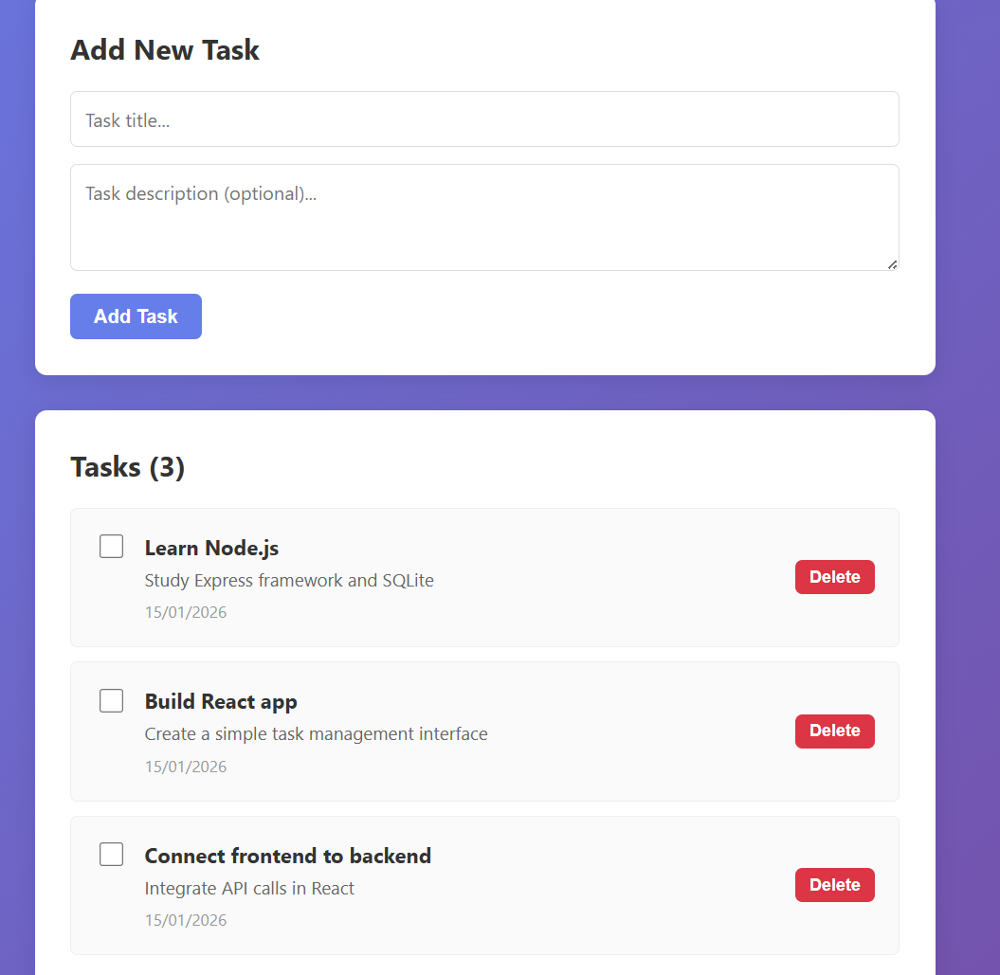

# Full-Stack Task Manager Application

A simple full-stack web application built with Node.js/Express backend, SQLite database, and React frontend. Includes CRUD operations for task management.

## Project Structure

```
basicfullstackproject/
├── server/              # Express backend
│   ├── server.js       # Main server file
│   ├── init-db.js      # Database initialization script
│   └── package.json    # Backend dependencies
├── client/             # React frontend
│   ├── src/
│   │   ├── App.js      # Main React component
│   │   ├── App.css     # Styling
│   │   └── index.js    # React entry point
│   ├── public/
│   │   └── index.html  # HTML template
│   └── package.json    # Frontend dependencies
└── README.md           # This file
```

## Features

- ✅ Create, read, update, and delete tasks
- ✅ Mark tasks as complete/incomplete
- ✅ Task descriptions and timestamps
- ✅ Clean, responsive UI
- ✅ SQLite database for persistence
- ✅ RESTful API with CORS support

## Prerequisites

- Node.js (v14 or higher)
- npm or yarn

## Setup Instructions

### 1. Backend Setup

```bash
cd server
npm install
```

Initialize the database with sample data:

```bash
npm run init-db
```

Start the backend server:

```bash
npm run dev
```

The server will run on `http://localhost:5000`

### 2. Frontend Setup

Open a new terminal and navigate to the client directory:

```bash
cd client
npm install
npm start
```

The frontend will automatically open at `http://localhost:3000`

## API Endpoints

- `GET /api/health` - Health check
- `GET /api/tasks` - Get all tasks
- `GET /api/tasks/:id` - Get a specific task
- `POST /api/tasks` - Create a new task
- `PUT /api/tasks/:id` - Update a task
- `DELETE /api/tasks/:id` - Delete a task

## Database Schema

### tasks table

```sql
CREATE TABLE tasks (
  id INTEGER PRIMARY KEY AUTOINCREMENT,
  title TEXT NOT NULL,
  description TEXT,
  completed INTEGER DEFAULT 0,
  created_at DATETIME DEFAULT CURRENT_TIMESTAMP,
  updated_at DATETIME DEFAULT CURRENT_TIMESTAMP
)
```

## Usage

1. Navigate to http://localhost:3000
2. Add a new task by filling in the title and optional description
3. Click "Add Task" to save
4. Check the checkbox to mark a task as complete
5. Click "Delete" to remove a task

## Dependencies

### Backend
- **express** - Web framework
- **sqlite3** - Database driver
- **cors** - Enable cross-origin requests
- **body-parser** - Parse request bodies
- **nodemon** (dev) - Auto-restart server on file changes

### Frontend
- **react** - UI library
- **axios** - HTTP client
- **react-scripts** - Build tools

## Screenshots



## Troubleshooting

**Frontend can't connect to backend:**
- Ensure the backend server is running on port 5000
- Check that CORS is properly configured in server.js
- Verify the API_URL in App.js matches your backend URL

**Database errors:**
- Run `npm run init-db` to reinitialize the database
- Check that database.db file is created in the server directory

## Future Enhancements

- User authentication and authorization
- Task categories/tags
- Due dates and reminders
- Task search and filtering
- User profiles and data persistence

## License

ISC
